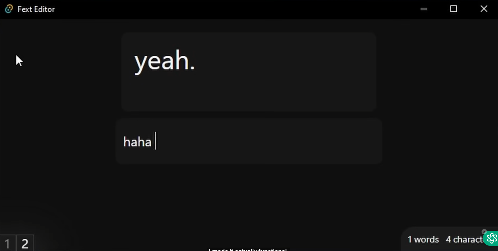
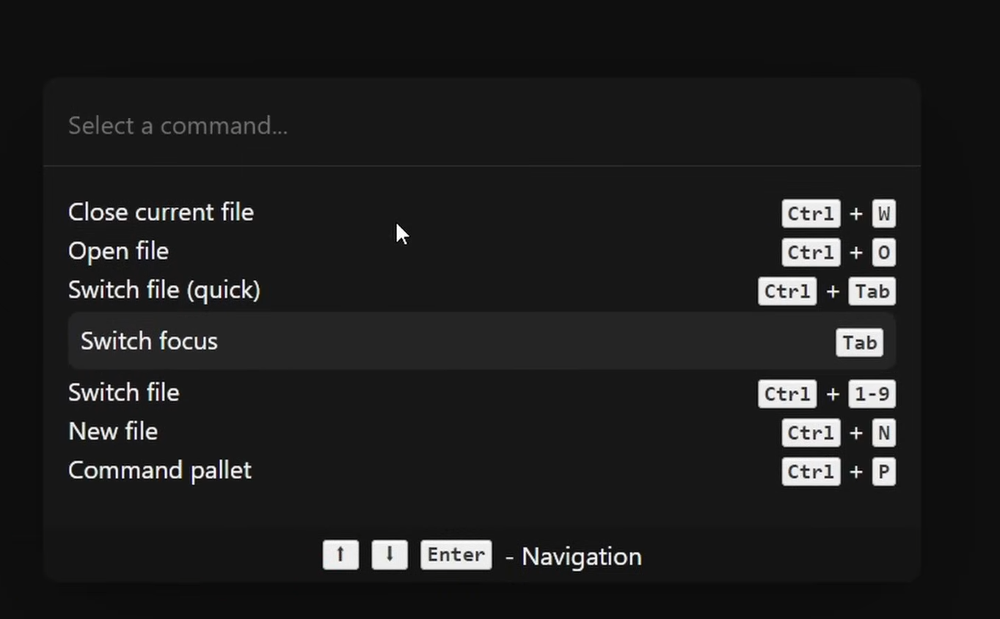
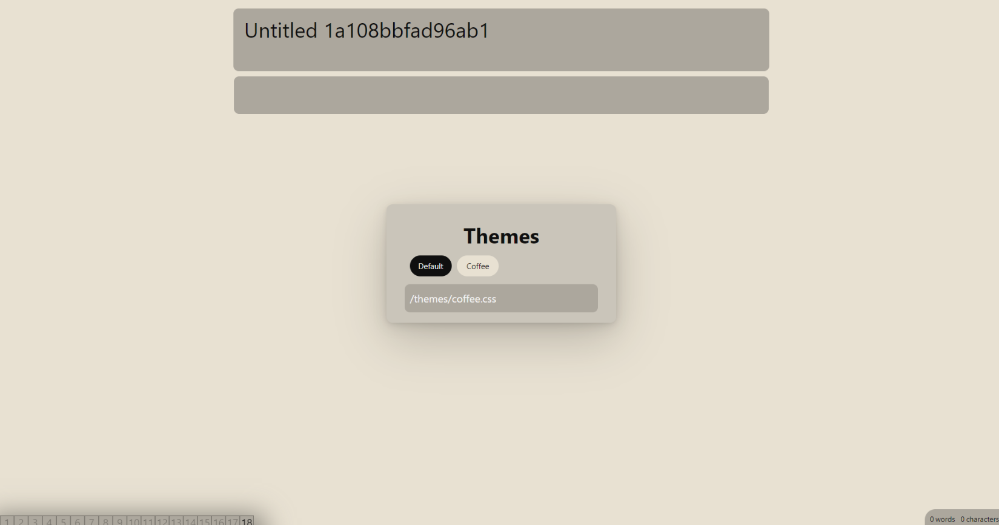

# Co-Snip

Co-Snip is a Rust-based desktop application designed to provide seamless and efficient code snippet management. The application allows users to save, organize, and retrieve code snippets easily.

## Features

- **Save and Organize Snippets**: Store your frequently used code snippets with ease.
- **Search Functionality**: Quickly find the code snippet you need.
- **Cross-Platform**: Works on Windows, macOS, and Linux.

## Technologies Used

Co-Snip is built using a variety of technologies to ensure performance, responsiveness, and ease of use:

- **Rust**: The core logic and performance-critical components.
- **JavaScript**: Enhancing interactivity and functionality within the app.
- **CSS**: Styling the application to provide a pleasant user interface.
- **HTML**: Structuring the user interface.
- **Dockerfile**: For containerization and easy deployment.

## Screenshots

### Homepage and other




### Themes



## Getting Started

### Prerequisites

- [Rust](https://www.rust-lang.org/tools/install)
- [Node.js](https://nodejs.org/)
- [Docker](https://www.docker.com/get-started) (optional, for containerization)

### Installation

1. **Clone the repository**:
   ```bash
   git clone https://github.com/01fe21bcs108/Co-Snip.git
   cd Co-Snip
   ```
2.   **Build the Rust project**:

   ```bash

cargo build --release
```
3. **Install Node.js dependencies**:

```bash

cd web
npm install
```
4. **Run the application**:

```bash

npm start
```
**Using Docker**
To run the application using Docker, use the following commands:

1.  **Build the Docker image**:

```bash

docker build -t co-snip .
```
2.  **Run the Docker container**:

```bash

docker run -p 8080:8080 co-snip
```

## THANK YOU
